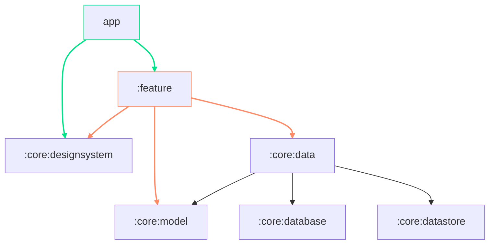
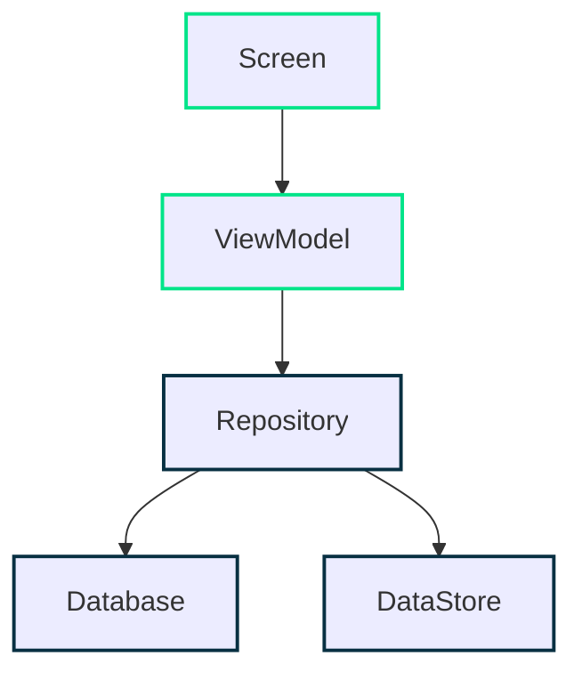

<a href="https://play.google.com/store/apps/details?id=com.colddelight.onestep"></a>

<br>


# OneStep
> 💡 **부위 별 운동 등록, 운동 루틴 설정, 운동 기록 애플리케이션**


### Feature
#### 홈
- 해당 루틴으로 운동한 총 일수 표출
- 루틴에 따른 이번주 운동 계획 및 현황 표출
- 해당 요일에 운동 유무에 따라 오늘의 운동 혹은 휴식일 표출
#### 루틴
- 해당 루틴으로 운동한 총 일수 표출
- 루틴 이름 관리
- 운동 리스트에 운동 이름과 세트 정보(횟수, 무게) 등록 및 수정, 삭제
- 요일 별로 운동과 세트 정보를 등록 및 수정, 삭제
#### 운동
- 등록한 루틴의 정보를 바탕으로 해당 요일의 운동 리스트와 진행 정보 표출
- 운동의 세트 정보를 표출
- 운동 중에도 세트 정보 수정 가능
- 세트가 끝날 때마다 휴식 타이머 표출, 휴식 타이머 또한 시간 조절 가능
#### 기록
- 운동을 한 날짜를 캘린더에 표출
- 해당 날짜 선택 시 그 날의 운동 및 세트 정보들 표출


### ScreenShots
| |  | |
|-|-|-|-|
|  |  | || 

<br>

# Module


<br>

# Architecture
**One Step**은 [Android Architecture Guide](https://developer.android.com/topic/architecture) 를 준수합니다.

### Overview
<center>

</center>

- Data, UI 총 두 개의 Layer로 구성되어 있습니다.
- [unidirectional data flow](https://developer.android.com/topic/architecture/ui-layer#udf) 를 준수합니다.

    - 상위 Layer는 하위 Layer의 변화에 반응한다.
    - Event는 상위에서 하위 Layer로 이동한다.
    - Data는 하위에서 상위 Layer로 이동한다.

- 데이터 흐름은 streams 통해 표현하며 Kotlin Flow를 사용합니다.



<br>

# Development
### Required
| Name | Version |
| --- | --- |
| IDE |   *```Android Studio Giraffe```* | 
| Kotlin |   *```1.9.10```* | 
| MinSdk  |   *```26```* | 
| TargetSdk  |   *```34```* | 


### Libraries
| Name | Version |
| --- | --- |
| Coroutines | *```1.7.3```* |
| Dagger-Hilt | *```2.48.1```* |
| Room | *```2.6.0```* |
| DataStore  | *```1.0.0```* |
| ComposeMaterial3  | *```1.2.0-beta01```* |
| NavigationCompose  | *```2.7.4```* |


> [!NOTE]
> 사용한 라이브러리 세부정보는 [libs.versions.toml](https://github.com/one-step-team/one-step-app/blob/dev/gradle/libs.versions.toml) 를 참고해 주세요.

<br>

# Team

|                                        Android                                         |                                              Android                                               |
|:-------------------------------------------------------------------------------------:|:-------------------------------------------------------------------------------------------------:|
| [](https://github.com/coldDelight) | [](https://github.com/see-ho) | 
| <a href="https://github.com/coldDelight">김찬희                                          |     <a href="https://github.com/see-ho">  이소희                                               | 
